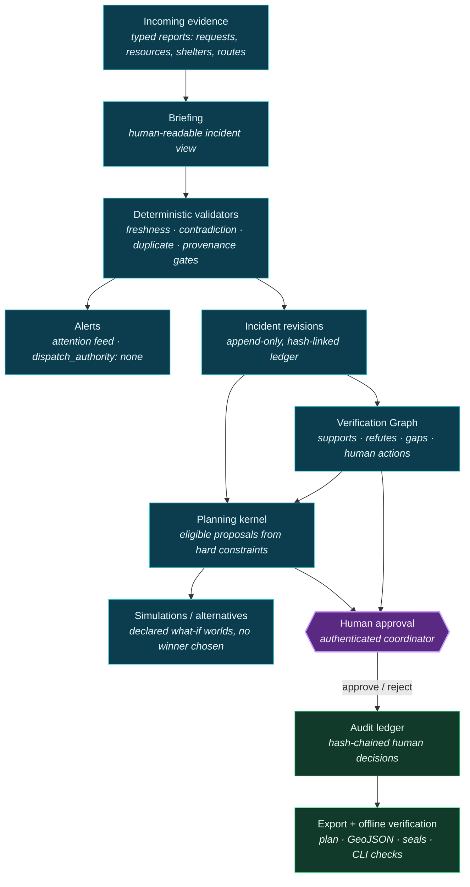
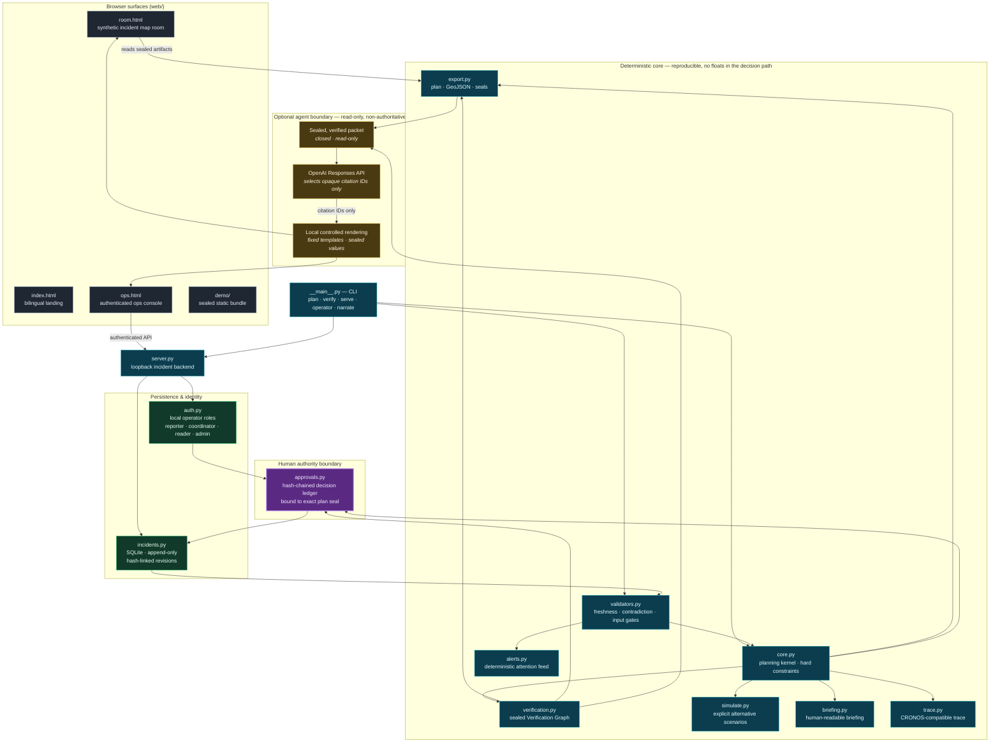

# LIFELINE — Architecture Diagrams

> The map is not the decision. The person is.

Two views of the same system. The first is the **incident lifecycle** — the path a
piece of evidence travels from a field report to a sealed, verifiable decision.
The second is the **full module map** — every component, the data it owns, and the
three trust boundaries the design enforces: the deterministic core, the human
authority boundary, and the optional, read-only agent boundary.

---

## 1. Incident lifecycle (overview)

**Reading it:** evidence is validated deterministically (validators can only
*downgrade* a claim, never upgrade it); revisions and the Verification Graph feed
a planning kernel that emits **proposals, not dispatches**; an accountable human
approves or rejects; the decision is sealed into a tamper-evident ledger that can
be checked offline. No box in this chart sends a responder or ranks a human life.

---

## 2. Full module map with trust boundaries

### The three boundaries, in one sentence each

- **Deterministic core (teal).** Produces eligible proposals from inspectable
  hard constraints — availability, capacity, medical compatibility, route status,
  provenance, freshness — with no floats in the decision path and every result
  sealed with SHA-256.
- **Human authority boundary (purple).** Only an authenticated coordinator can
  approve or reject a proposal, and each decision is hash-chained to the exact
  plan seal. The software never dispatches.
- **Optional agent boundary (amber).** After a plan is sealed *and* verified, a
  closed read-only packet may go to OpenAI, which returns only opaque citation
  IDs; LIFELINE renders every visible sentence locally from fixed templates. The
  model cannot invent a fact, change a record, or issue an instruction.
